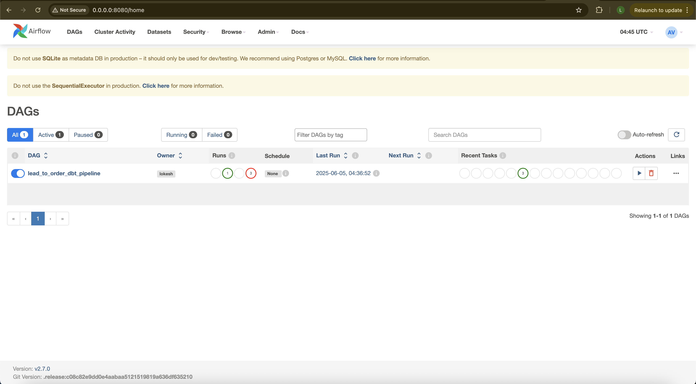
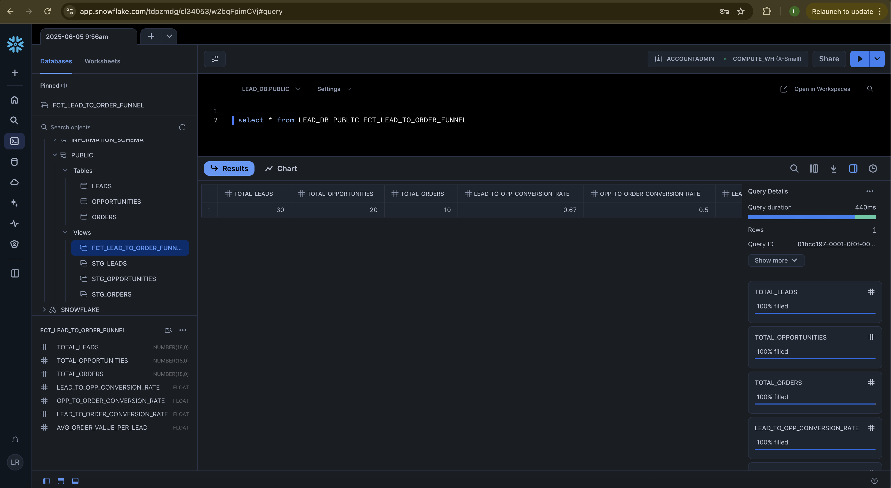

# Lead-to-Order Funnel Analytics with dbt + Snowflake

This project simulates a real-world **CRM Sales Funnel** to showcase end-to-end data transformation using **dbt**, data warehousing with **Snowflake**, and optional orchestration via **Airflow**.

---

## Use Case

Track the **conversion funnel** from:
- Leads → Opportunities → Orders

Includes metrics like:
- Lead-to-Opportunity Conversion Rate
- Opportunity-to-Order Conversion Rate
- Average Order Value per Lead

---

## Tech Stack

| Layer              | Tool                     |
|--------------------|--------------------------|
| Data Warehouse     | Snowflake             |
| Transformation     | dbt-core               |
| Orchestration      | Apache Airflow        |
| Version Control    | GitHub                   |
| Data Source        | CSV Seeds                |

---

## Project Structure

.
├── airflow/ # Airflow setup with DAGs
│ └── dags/
│ └── dbt_dag.py # Airflow DAG triggering dbt run
├── dbt/ # dbt project directory
│ ├── models/
│ │ ├── staging/
│ │ │ ├── stg_leads.sql
│ │ │ ├── stg_opportunities.sql
│ │ │ └── stg_orders.sql
│ │ └── marts/
│ │ └── fct_lead_to_order_funnel.sql
│ ├── seeds/
│ │ ├── leads.csv
│ │ ├── opportunities.csv
│ │ └── orders.csv
│ ├── dbt_project.yml
│ └── profiles.yml
├── docker-compose.yml
└── README.md


---

## Setup Instructions

### Clone the repo

```bash
git clone https://github.com/yourusername/lead-to-order-funnel.git
cd lead-to-order-funnel
```


## Edit dbt connection
Update the dbt/profiles.yml file with your Snowflake credentials:

```yaml
default:
  target: dev
  outputs:
    dev:
      type: snowflake
      account: <snowflake account name>
      user: your_username
      password: your_password
      role: ACCOUNTADMIN
      database: LEAD_DB # Create the database LEAD_DB in snowflake or replace your db name here
      warehouse: COMPUTE_WH # Create the warehouse COMPUTE_WH in snowflake or replace your warehouse here
      schema: PUBLIC
      threads: 1
      client_session_keep_alive: False
```


## Run

```bash
docker-compose up --build
```


## Access Airflow UI
Visit: http://localhost:8080

Default username: admin
Password: admin (or as configured)


# Trigger the DAG
DAG name: dbt_lead_to_order_pipeline

It will run:
dbt seed
dbt run
dbt test



### View Results in Snowflake
Login to Snowflake UI
Use Worksheet with:

```sql
SELECT * FROM PUBLIC.stg_leads;
SELECT * FROM PUBLIC.stg_opportunities;
SELECT * FROM PUBLIC.stg_orders;
SELECT * FROM PUBLIC.fct_lead_to_order_funnel;
```

